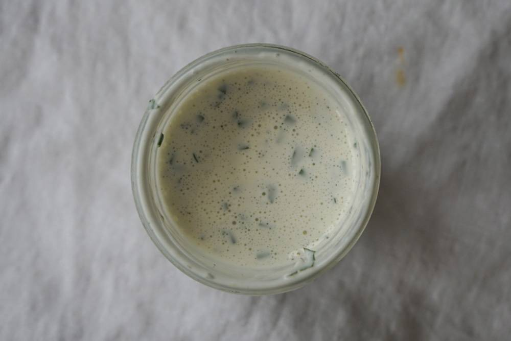

**Уровень сложности**: Не сложно

## Соус ранч
Ранч хорош с запеченной курицей, салатами на основе айсберга и как дип для овощных палочек. Для приготовления понадобится только венчик.

Для этого соуса нужна пахта — сыворотка, которая остается при сбивании сливок или сметаны. Она дает соусам приятный нежный подтон. Раньше пахту можно было найти в молочных отделах, сейчас в магазинах она встречается редко.

### Ингредиенты для основы  

<table>
    <tbody>
      <tr>
        <td>Молоко</td>
        <td>50 мл</td>
      </tr>
      <tr>
        <td>Майонез</td>
        <td>3 ст. л.</td>
      </tr>
      <tr>
        <td>Рубленая петрушка</td>
        <td>2 ст. л.</td>
      </tr>
      <tr>
        <td>Рубленый зеленый лук</td>
        <td>2 ст. л.</td>
      </tr>
      <tr>
        <td>Лимонный сок</td>
        <td>1 ч. л.</td>
      </tr>
      <tr>
        <td>Молотый сушеный чеснок</td>
        <td>1/2 ч. л.</td>
      </tr>
      <tr>
        <td>Соль, перец</td>
        <td>По вкусу</td>
      </tr>
    </tbody>
</table>
 

**Шаг 1**. Молоко смешайте с лимонным соком и дайте постоять минуту — получится пахта.
**Шаг 2**. Венчиком взбейте пахту с майонезом, рублеными травами и специями.