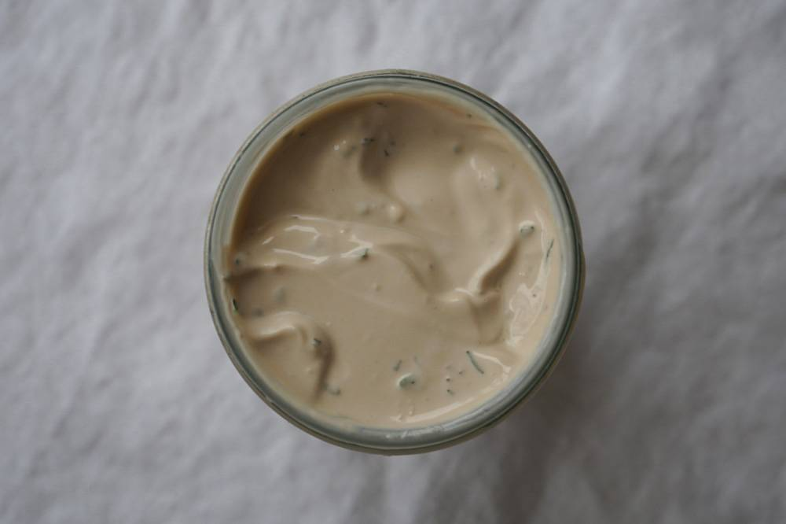
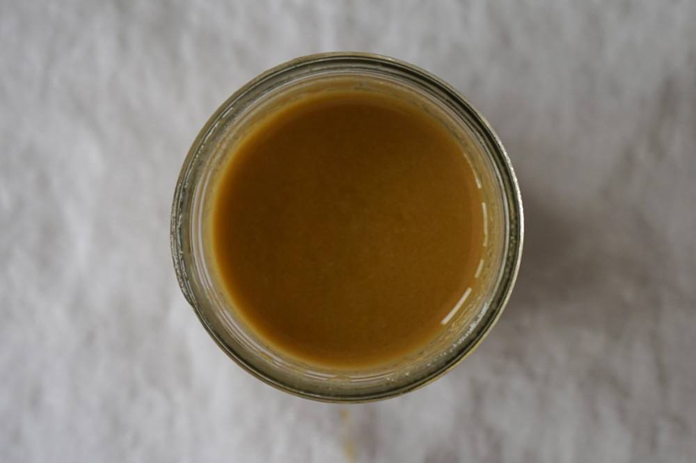
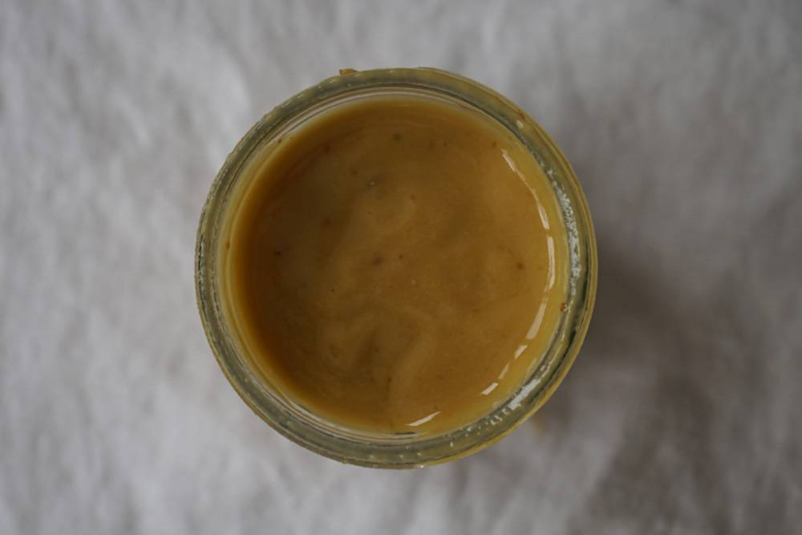
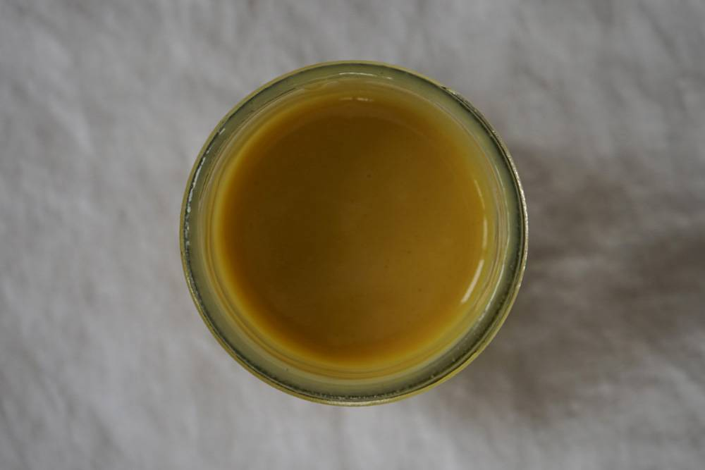
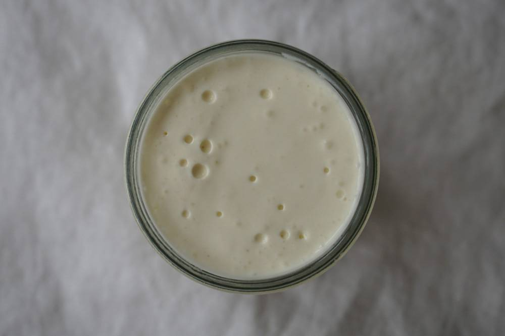

**Уровень сложности**: Не сложно

## Соус ранч
Ранч хорош с запеченной курицей, салатами на основе айсберга и как дип для овощных палочек. Для приготовления понадобится только венчик.

Для этого соуса нужна пахта — сыворотка, которая остается при сбивании сливок или сметаны. Она дает соусам приятный нежный подтон. Раньше пахту можно было найти в молочных отделах, сейчас в магазинах она встречается редко.

### Ингредиенты для соуса ранч

<table>
    <tbody>
      <tr>
        <td>Молоко</td>
        <td>50 мл</td>
      </tr>
      <tr>
        <td>Майонез</td>
        <td>3 ст. л.</td>
      </tr>
      <tr>
        <td>Рубленая петрушка</td>
        <td>2 ст. л.</td>
      </tr>
      <tr>
        <td>Рубленый зеленый лук</td>
        <td>2 ст. л.</td>
      </tr>
      <tr>
        <td>Лимонный сок</td>
        <td>1 ч. л.</td>
      </tr>
      <tr>
        <td>Молотый сушеный чеснок</td>
        <td>1/2 ч. л.</td>
      </tr>
      <tr>
        <td>Соль, перец</td>
        <td>По вкусу</td>
      </tr>
    </tbody>
</table>
 

**Шаг 1**. Молоко смешайте с лимонным соком и дайте постоять минуту — получится пахта.

**Шаг 2**. Венчиком взбейте пахту с майонезом, рублеными травами и специями.

---

## Итальянский соус
Этот соус хорош в овощных салатах с травами, салатах с пастой и с запеченной рыбой. Для приготовления понадобится блендер.

### Ингредиенты для итальянского соуса

<table>
    <tbody>
      <tr>
        <td>Майонез</td>
        <td>4 ст. л.</td>
      </tr>
      <tr>
        <td>Красный винный уксус</td>
        <td>2 ст. л.</td>
      </tr>
      <tr>
        <td>Сметана</td>
        <td>2 ст. л.</td>
      </tr>
      <tr>
        <td>Оливковое масло</td>
        <td>2 ст. л.</td>
      </tr>
      <tr>
        <td>Рубленая петрушка</td>
        <td>1 ст. л.</td>
      </tr>
      <tr>
        <td>Сушеный тимьян</td>
        <td>1/2 ч. л.</td>
      </tr>
      <tr>
        <td>Сушеный розмарин</td>
        <td>1/2 ч. л.</td>
      </tr>
      <tr>
        <td>Соль</td>
        <td>1/2 ч. л.</td>
      </tr>
      <tr>
        <td>Чеснок</td>
        <td>1 зубчик</td>
      </tr>
    </tbody>
</table>
 

**Шаг 1**. Все ингредиенты, кроме петрушки, взбейте в блендере до однородности.

**Шаг 2**. Порубите зелень и добавьте к соусу.

---

## Классический соус винегрет
Винегрет украсит салаты с большим количеством зелени, а еще в нем можно замариновать рыбу и курицу. Для приготовления понадобится только венчик.

### Ингредиенты для соуса винегрет

<table>
    <tbody>
      <tr>
        <td>Оливковое масло</td>
        <td>5 ст. л.</td>
      </tr>
     <tr>
        <td>Красный винный уксус</td>
        <td>2 ст. л.</td>
      </tr>
      <tr>
        <td>Дижонская горчица</td>
        <td>2 ст. л.</td>
      </tr>
      <tr>
        <td>Соль</td>
        <td>1 ч. л.</td>
      </tr>
    </tbody>
</table>
 

**Шаг 1**. Уксус, горчицу и соль взбейте венчиком.

**Шаг 2**. Продолжая взбивать, тонкой струйкой влейте оливковое масло.

---

## Соус с запеченным чесноком
Это универсальный соус: заправляйте им пасту, запеченные овощи или простой зеленый салат. Для приготовления понадобится духовка и блендер.

### Ингредиенты для соуса с запеченным чесноком

<table>
    <tbody>
      <tr>
        <td>Оливковое масло</td>
        <td>5 ст. л.</td>
      </tr>
     <tr>
        <td>Тертый пармезан</td>
        <td>3 ст. л.</td>
      </tr>
      <tr>
        <td>Красный винный уксус</td>
        <td>2 ст. л.</td>
      </tr>
      <tr>
        <td>Дижонская горчица</td>
        <td>2 ч. л.</td>
      </tr>
      <tr>
        <td>Чеснок</td>
        <td>1 головка</td>
      </tr>
      <tr>
        <td>Соль</td>
        <td>1 ч. л.</td>
      </tr>
      <tr>
        <td>Черный молотый перец</td>
        <td>По вкусу</td>
      </tr>
    </tbody>
</table>
 

**Шаг 1**. У чеснока срежьте верхнюю часть так, чтобы были видны зубчики.

**Шаг 2**. Полейте чеснок оливковым маслом, заверните в фольгу. Запекайте в духовке 25 минут при 200 °С.

**Шаг 3**. Дайте чесноку остыть и выдавите зубчики из оболочки.

**Шаг 4**. В блендере взбейте чеснок с маслом, пармезаном, уксусом, горчицей, солью и перцем.

---

## Медово-горчичный соус
Эта яркая заправка отлично подходит к салатам и горячим блюдам с красной рыбой, запеченной курице, а также как дип для наггетсов. Для приготовления понадобится только венчик.

### Ингредиенты для медово-горчичного соуса

<table>
    <tbody>
      <tr>
        <td>Оливковое масло</td>
        <td>4 ст. л.</td>
      </tr>
     <tr>
        <td>Мед</td>
        <td>2 ст. л.</td>
      </tr>
      <tr>
        <td>Белый винный уксус</td>
        <td>2 ст. л.</td>
      </tr>
      <tr>
        <td>Дижонская горчица</td>
        <td>2 ст. л.</td>
      </tr>
      <tr>
        <td>Соль</td>
        <td>1/2 ч. л.</td>
      </tr>
      <tr>
        <td>Черный молотый перец</td>
        <td>По вкусу</td>
      </tr>
    </tbody>
</table>
 

**Шаг 1**. Мед, горчицу, уксус, соль и перец взбейте венчиком.

**Шаг 2**. Продолжая взбивать, влейте оливковое масло тонкой струйкой.

---

## Соус из сыра дорблю
Этот плотный и яркий соус отлично дополняет и легкие овощные салаты, и более сложные, с большим количеством ингредиентов. Например, салат кобб. А еще это отличный дип для овощных палочек.

Для приготовления понадобится только венчик. Если вкус сыра дорблю кажется вам слишком интенсивным, замените его фетой.

<table>
    <tbody>
      <tr>
        <td>Сыр дорблю</td>
        <td>60 г</td>
      </tr>
     <tr>
        <td>Молоко</td>
        <td>50 мл</td>
      </tr>
      <tr>
        <td>Сметана</td>
        <td>4 ст. л.</td>
      </tr>
      <tr>
        <td>Сок лимона</td>
        <td>Из половины фрукта</td>
      </tr>
      <tr>
        <td>Соль</td>
        <td>по вкусу</td>
      </tr>
      <tr>
        <td>Соус чили</td>
        <td>По вкусу</td>
      </tr>
    </tbody>
</table>
 

**Шаг 1**. Молоко смешайте с чайной ложкой лимонного сока и дайте постоять одну минуту — получится пахта. Она придаст соусу нежность.

**Шаг 2**. Венчиком взбейте пахту со сметаной, оставшимся лимонным соком, сыром, солью и острым соусом.

